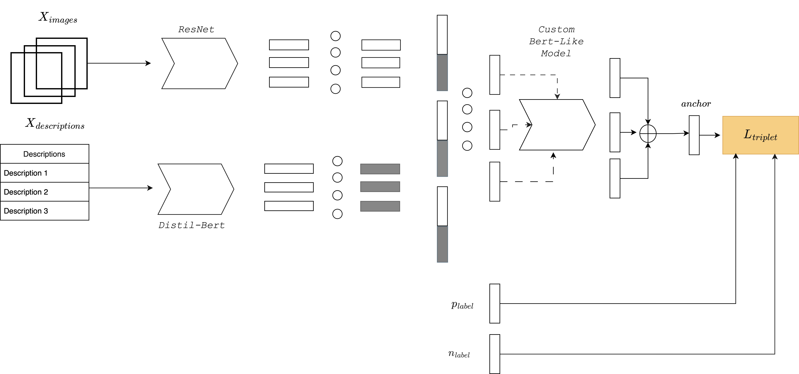

# BERT for FITB
Prof: Vito Walter Anelli

Authors:Antonio De Candia,Riccardo Fusco
# Table of Contents
- [Usage](#usage)
- [Architecture](#architecture--bertpy-)
- [DataSet](#dataset--datasetpy-)
- [Trainer](#trainer--trainerpy-)
- [Main](#mainpy)
- [Inference](#inferencepy)
- [InferenceDemo](#inferencedemopy)
- [Utilities](#utilitiespy--optional-)
- [Resources](#resources-)

This is a university project for the DeepLearning course in which we were required to implement a Bert-Like model capable of accomplishing the Fill-in-the-blank task in the fashion domain.The model takes as input a sequence of items(clothes images) and predicts the missing one given the context.
The limitations imposed by the trace are that the items that make up the sequence must a depart to only 4 categories and that the query is constrained to be of 4 items.

## Usage

To interact with the code, simply clone the repository and install the libraries listed in the requirements.txt.Since the project was not created to be a production-ready model we think the best use of this code may be to inspect the code to understand the underlying idea. 

## Architecture(Bert.py)

Architecture Schematic(*Realized with Diagram.net*)

Since the **DataSet** is composed of items with respective descriptions as suggested in the paper that we cite at the end of this document we use also them as input to the model. In fact, the model is composed of two Pre-Trained architectures, a ResNet-18 and a DistilBert to create embeddings of images and respective descriptions.These embeddings are combined respectively and sent as input to the Bert-Like model made by scratch.

In the [Bert.py](http://bert.py/) module, the distinction between Embedder and custom Bert-like models that are composed to create the overall architecture is evident.

The Bert-like custom model follows Bert's architecture perfectly, and it was made as simple as possible without variations on the theme.

## Dataset(dataset.py)

From the proposed datasets, the polyvore dataset was chosen, which can be downloaded from the following link https://drive.google.com/file/d/13-J4fAPZahauaGycw3j_YvbAHO7tOTW5/view.

The dataset consists of 260k images of clothing organized into outfits. In addition to the folder containing the images there are json files that allow interaction with each individual item and some also contain metadata about them.

## Trainer(trainer.py)

Everything needed to train the model is here.Simply pass to the trainer, the model and two datasets(Training,Validation) as is done in the main.py. 

## main.py

Contains the parameters of the model we are going to train, the creation of training and validation dataset and starts the training

## inference.py

Inside we have a useful class to show how model inference works.The model concretely takes as input a query and candidates and chooses the candidate with the smallest squared distance from the predicted one.The use of this class is shown in the module inference_demo.py. 

## inference_demo.py

Takes a random model, useful only to show how inference works, and passes it to an instance of the inferencer class.The selected idx corresponds to the index of the query within the dataset whose missing piece we want to predict

## utilities.py(OPTIONAL)

Contains functions that were useful in the development and testing of the model but are not currently called in any of the modules listed before

## RESOURCES 😃

1. {Eduardo Castro1 · Pedro M. Ferreira2 · Ana Rebelo1 · Isabel Rio-Torto1 · Leonardo Capozzi1 ·
Mafalda Falcão Ferreira1 · Tiago Gonçalves1 · Tomé Albuquerque1 · Wilson Silva1 · Carolina Afonso2 ·
Ricardo Gamelas Sousa2 · Claudio Cimarelli3 · Nadia Daoudi3 · Gabriel Moreira4 · Hsiu-yu Yang5 · Ingrid Hrga6 · Javed Ahmad7,8 · Monish Keswani9 · Sofia Beco10 (2022). Title of the Paper. *Fill in the blank for fashion complementary outfit product Retrieval: VISUM summer school competition*, Volume(Issue), Page-Page: (https://link.springer.com/article/10.1007/s00138-022-01359-x)